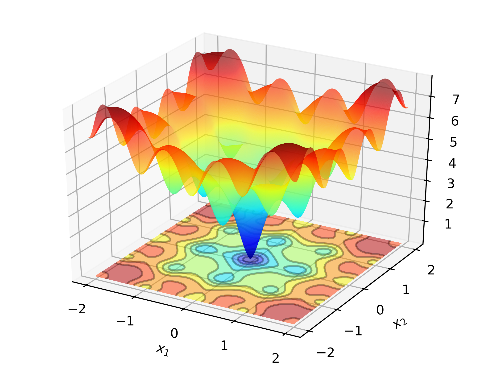
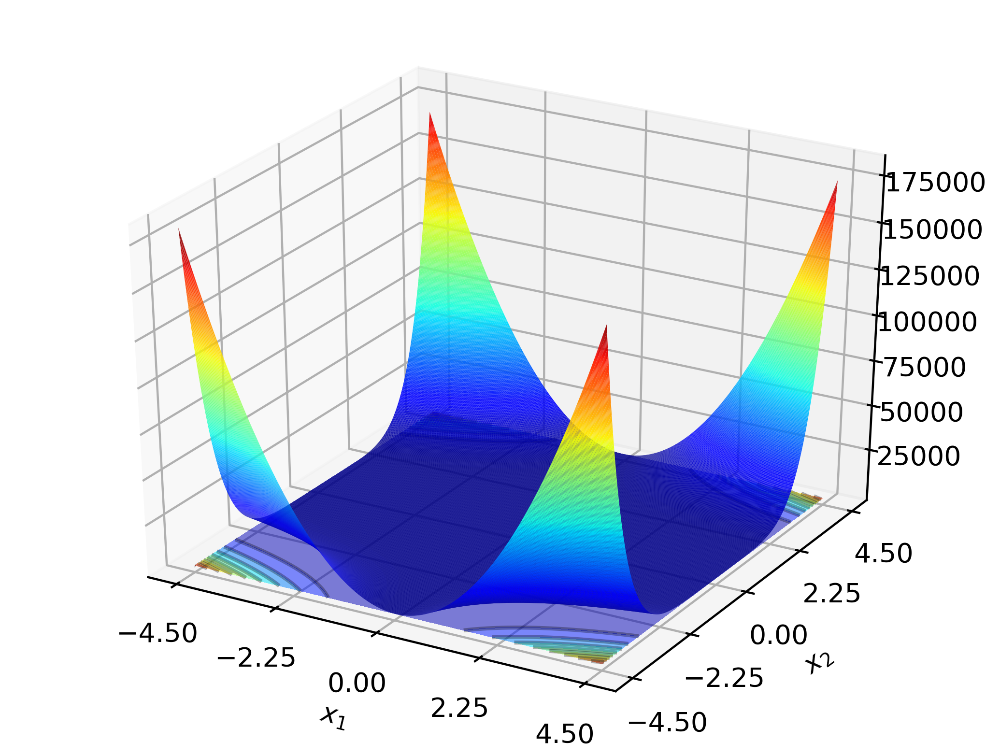
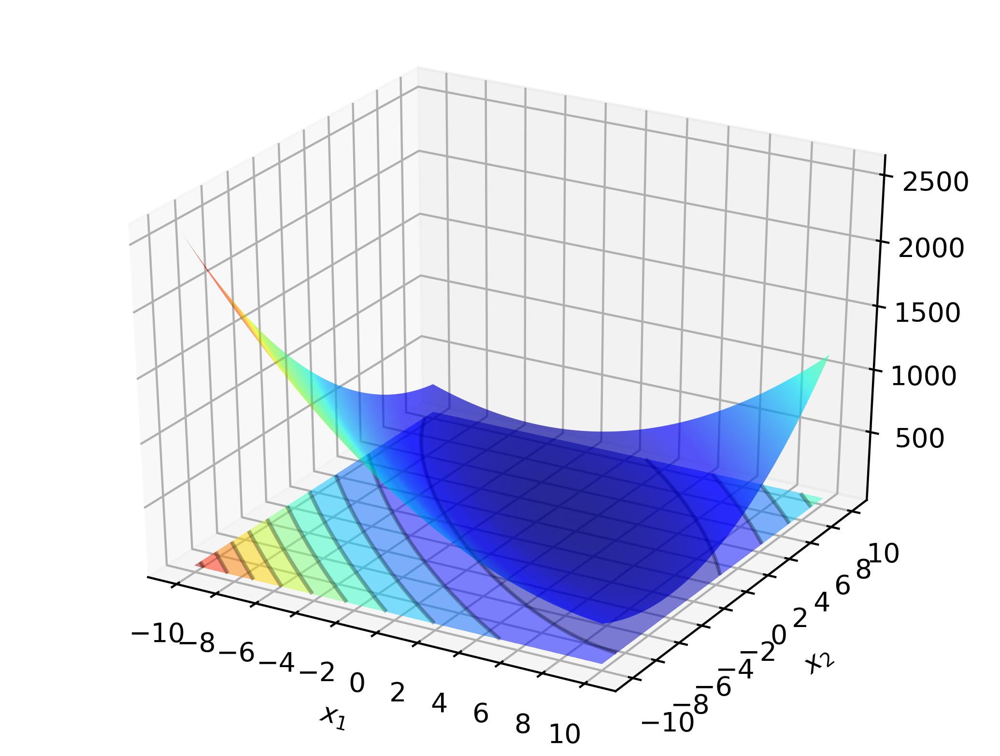
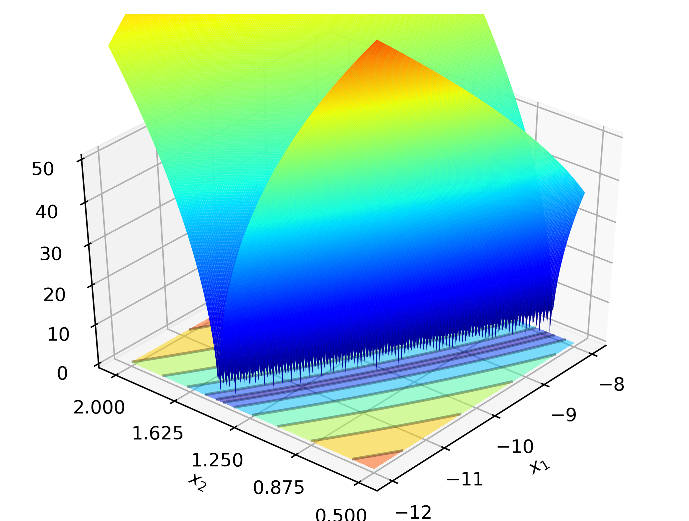
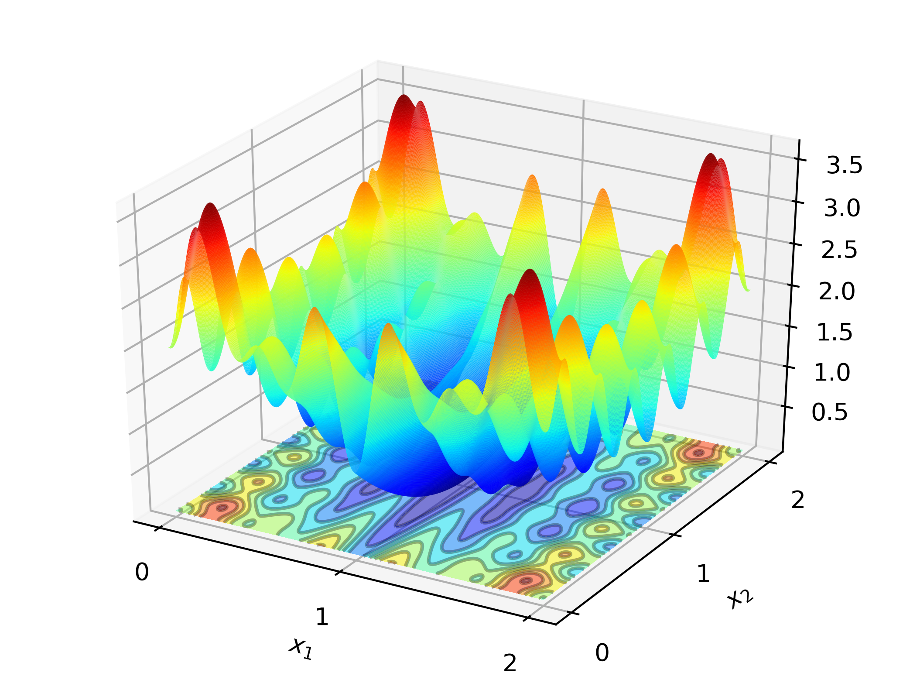
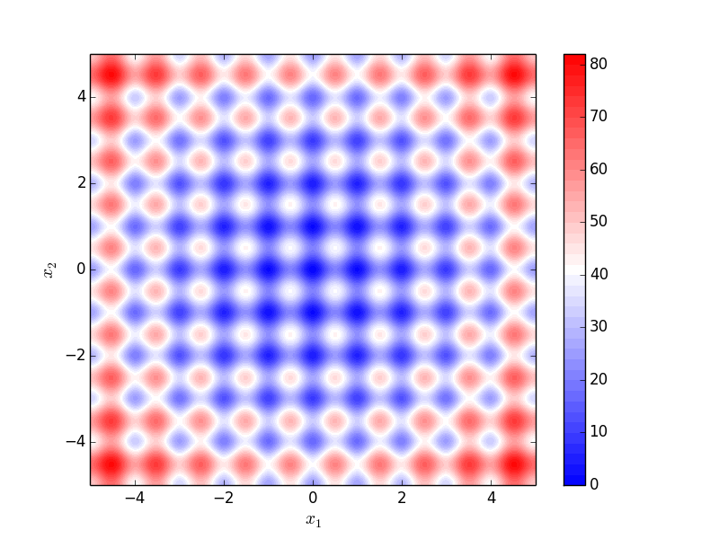
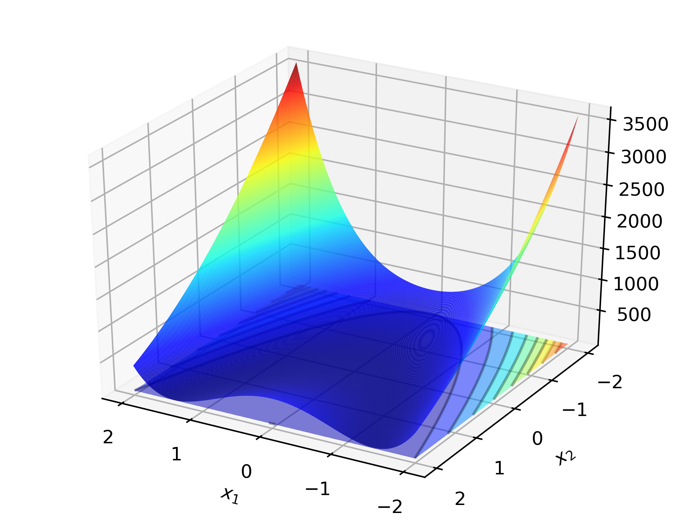
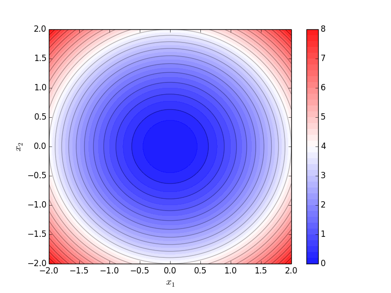
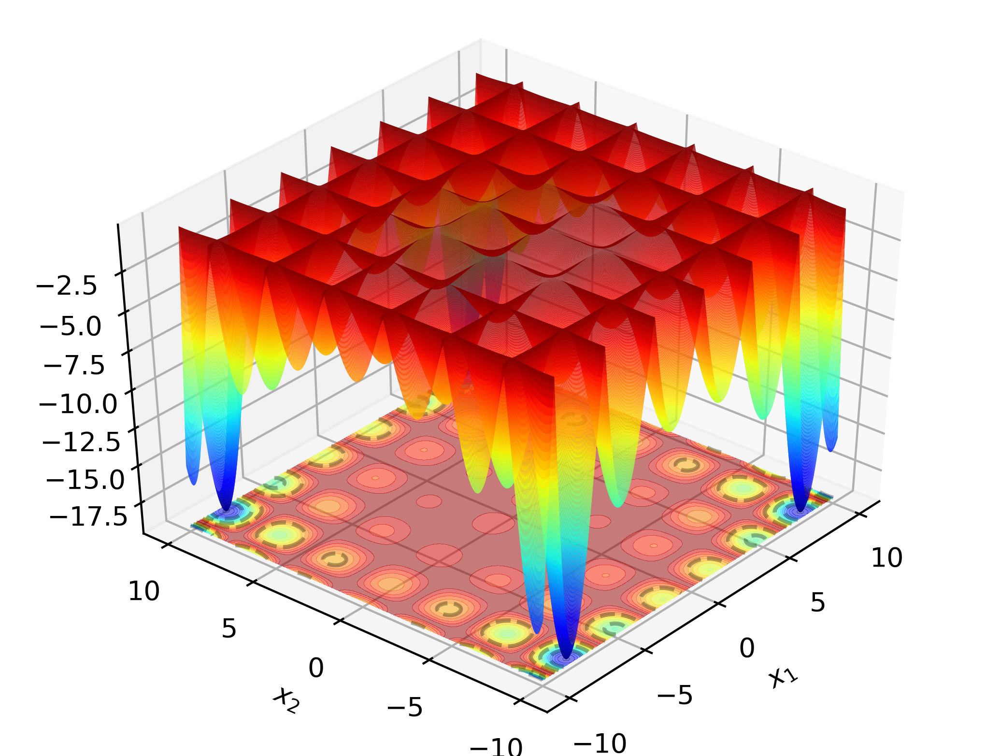

.. Copyright (c) 2016-2020 Keith O'Hara

   Distributed under the terms of the Apache License, Version 2.0.

   The full license is in the file LICENSE, distributed with this software.

Test Functions
==============

**Table of contents**

.. contents:: :local:

----

.. _ackley_fn:

Ackley Function
---------------

The Ackley function is given by:

.. math::

    \min_{x \in [-5,5]^2} \left\{ 20 + \exp(1) - 20 \exp \left( -0.2\sqrt{0.5(x_1^2 + x_2^2)} \right) - \exp \left( 0.5 [\cos(2 \pi x_1) + \cos(2 \pi x_2)] \right) \right\}

The minimum value is attained at :math:`(0, 0)`. 

A plot of the function is given below.

Code to run this example is given below.

.. toggle-header::
    :header: **Code (Click to show/hide)**

    .. code:: cpp

        #define OPTIM_PI 3.14159265358979

        double 
        ackley_fn(const Vec_t& vals_inp, Vec_t* grad_out, void* opt_data)
        {
            const double x = vals_inp(0);
            const double y = vals_inp(1);

            double obj_val = 20 + std::exp(1) - 20*std::exp( -0.2*std::sqrt(0.5*(x*x + y*y)) ) - std::exp( 0.5*(std::cos(2 * OPTIM_PI * x) + std::cos(2 * OPTIM_PI * y)) );
            
            return obj_val;
        }

----

Beale Function
--------------

The Beale function is given by:

.. math::

    \min_{x \in [-4.5,4.5]^2} \left\{ (1.5 - x_1 + x_1 x_2)^2 + (2.25 - x_1 + x_1 x_2^2)^2 + (2.625 - x_1 + x_1 x_2^3)^2 \right\}

The minimum value is attained at :math:`(3, 0.5)`. The function is non-convex.

- The gradient is given by

.. math::

    \nabla_x f(x) = \begin{bmatrix} 2 (1.5 - x_1 + x_1 x_2) (x_2 - 1) + 2 (2.25 - x_1 + x_1 x_2^2)(x_2^2 - 1) + 2 (2.625 - x_1 + x_1 x_2^3)(x_2^3 - 1) \\ 
    2 (1.5 - x_1 + x_1 x_2)(x_1) + 2(2.25 - x_1 + x_1 x_2^2)(2 x_1 x_2) + 2 (2.625 - x_1 + x_1 x_2^3)(3 x_1 x_2^2) \end{bmatrix}

- The elements of the Hessian matrix are;

.. math::

    \begin{aligned}
        H_{11} &= 2 x_2^6 + 2 x_2^4 - 4 x_2^3 - 2 x_2^2 - 4 x_2 + 6 \\
        H_{12} = H_{21} &= 12 x_1 x_2^5 + 8 x_1 x_2^3 - 12 x_1 x_2^2 - 4 x_1 x_2 - 4 x_1 + 15.75 x_2^2 + 9 x_2 + 3\\
        H_{22} &= 30 x_1^2 x_2^4 + 12 x_1^2 x_2^2 - 12 x_1^2 x_2 - 2 x_1^2 + 31.5 x_1 x_2 + 9 x_1
    \end{aligned}

A plot of the function is given below.

Code to run this example is given below.

.. toggle-header::
    :header: **Code (Click to show/hide)**

    .. code:: cpp

        double 
        beale_fn(const Vec_t& vals_inp, Vec_t* grad_out, void* opt_data)
        {
            const double x_1 = vals_inp(0);
            const double x_2 = vals_inp(1);

            // compute some terms only once 

            const double x2sq = x_2 * x_2;
            const double x2cb = x2sq * x_2;
            const double x1x2 = x_1*x_2;

            // 

            double obj_val = std::pow(1.5 - x_1 + x1x2, 2) + std::pow(2.25 - x_1 + x_1*x2sq, 2) + std::pow(2.625 - x_1 + x_1*x2cb, 2);

            if (grad_out) {
                (*grad_out)(0) = 2 * ( (1.5 - x_1 + x1x2)*(x_2 - 1) + (2.25 - x_1 + x_1*x2sq)*(x2sq - 1) + (2.625 - x_1 + x_1*x2cb)*(x2cb - 1)   );
                (*grad_out)(1) = 2 * ( (1.5 - x_1 + x1x2)*(x_1)     + (2.25 - x_1 + x_1*x2sq)*(2*x1x2)   + (2.625 - x_1 + x_1*x2cb)*(3*x_1*x2sq) );
            }
            
            return obj_val;
        }

----

Booth Function
--------------

The Booth function is given by:

.. math::

    \min_{x \in [-10,10]^2} \left\{ (x_1 + 2 x_2 -7)^2 + (2 x_1 + x_2 - 5)^2 \right\}

The minimum value is attained at :math:`(1, 3)`. 

- The gradient (ignoring the box constraints) is given by

.. math::

    \nabla_x f(x) = \begin{bmatrix} 2 (x_1 + 2 x_2 -7) + 4 (2 x_1 + x_2 - 5) \\ 4 (x_1 + 2 x_2 -7) + 2 (2 x_1 + x_2 - 5) \end{bmatrix} 
    = \begin{bmatrix} 10 x_1 + 8 x_2 - 34 \\ 8 x_1 + 10 x_2 - 38 \end{bmatrix}

- The hessian is given by

.. math::

    \nabla_x [\nabla_x^\top f(x)] = \begin{bmatrix} 10 & 8 \\ 8 & 10 \end{bmatrix}

A plot of the function is given below.

Code to run this example is given below.

.. toggle-header::
    :header: **Code (Click to show/hide)**

    .. code:: cpp

        double 
        booth_fn(const Vec_t& vals_inp, Vec_t* grad_out, void* opt_data)
        {
            double x_1 = vals_inp(0);
            double x_2 = vals_inp(1);
        
            double obj_val = std::pow(x_1 + 2*x_2 - 7.0, 2) + std::pow(2*x_1 + x_2 - 5.0, 2);
            
            if (grad_out) {
                (*grad_out)(0) = 10*x_1 + 8*x_2 - 34;
                (*grad_out)(1) = 8*x_1 + 10*x_2 - 38;
            }
            
            return obj_val;
        }

Bukin Function
--------------

The Bukin function (N. 6) is given by:

.. math::

    \min_{x \in [-15,-5] \times [-3,3]} \left\{ 100 \sqrt{\left| x_2 - 0.01 x_1^2 \right|} + 0.01 \left| x_1 + 10 \right| \right\}

The minimum value is attained at :math:`(-10, 1)`.

A plot of the function is given below.

Code to run this example is given below.

.. toggle-header::
    :header: **Code (Click to show/hide)**

    .. code:: cpp

        double 
        bukin_fn(const Vec_t& vals_inp, Vec_t* grad_out, void* opt_data)
        {
            const double x = vals_inp(0);
            const double y = vals_inp(1);

            double obj_val = 100*std::sqrt(std::abs(y - 0.01*x*x)) + 0.01*std::abs(x + 10);
            
            return obj_val;
        }

----

Levi Function
-------------

The Levi function (N. 13) is given by:

.. math::

    \min_{x \in [-10,10]^2} \left\{ (\sin(3 \pi x_1))^2 + (x_1-1)^2 (1 + (\sin(3 \pi x_2))^2) + (x_2-1)^2 (1 + (\sin(2 \pi x_1))^2) \right\}

The minimum value is attained at :math:`(1, 1)`. 

A plot of the function is given below.

Code to run this example is given below.

.. toggle-header::
    :header: **Code (Click to show/hide)**

    .. code:: cpp

        #define OPTIM_PI 3.14159265358979

        double 
        levi_fn(const Vec_t& vals_inp, Vec_t* grad_out, void* opt_data)
        {
            const double x = vals_inp(0);
            const double y = vals_inp(1);
            const double pi = OPTIM_PI;

            double obj_val = std::pow( std::sin(3*pi*x), 2) + std::pow(x-1,2)*(1 + std::pow( std::sin(3 * OPTIM_PI * y), 2)) + std::pow(y-1,2)*(1 + std::pow( std::sin(2 * OPTIM_PI * x), 2));
            
            return obj_val;
        }

----

Rastrigin Function
------------------

The 2D Rastrigin function is given by:

.. math::

    \min_{x \in [-5,5]} \left\{ 20 + (x_1^2 - 10 \times \cos(2 \pi x_1)) + (x_2^2 - 10 \times \cos(2 \pi x_2)) \right\}

The minimum value is attained at :math:`(0, 0)`. 

A plot of the function is given below.

Code to run this example is given below.

.. toggle-header::
    :header: **Code (Click to show/hide)**

    .. code:: cpp

        #define OPTIM_PI 3.14159265358979

        double 
        rastrigin_fn(const Vec_t& vals_inp, Vec_t* grad_out, void* opt_data)
        {
            const double x_1 = vals_inp(0);
            const double x_2 = vals_inp(1);

            double obj_val = 20 + x_1*x_1 + x_2*x_2 - 10 * (std::cos(2*OPTIM_PI*x_1) + std::cos(2*OPTIM_PI*x_2))
            
            return obj_val;
        }

----

Rosenbrock Function
-------------------

The 2D Rosenbrock function is given by:

.. math::

    \min_{x \in \mathbb{R}^2} \left\{ 100 (x_2 - x_1^2)^2 + (1-x_1)^2 \right\}

The minimum value is attained at :math:`(1, 1)`. 

- The gradient is given by

.. math::

    \nabla_x f(x) = \begin{bmatrix} -400(x_2 - x_1^2)(x_1) - 2(1-x_1) \\ 200(x_2 - x_1^2) \end{bmatrix}

A plot of the function is given below.

Code to run this example is given below.

.. toggle-header::
    :header: **Code (Click to show/hide)**

    .. code:: cpp

        double 
        rosenbrock_fn(const Vec_t& vals_inp, Vec_t* grad_out, void* opt_data)
        {
            const double x_1 = vals_inp(0);
            const double x_2 = vals_inp(1);

            const double x1sq = x_1 * x_1;

            double obj_val = 100*std::pow(x_2 - x1sq,2) + std::pow(1-x_1,2);
            
            if (grad_out) {
                (*grad_out)(0) = -400*(x_2 - x1sq)*x_1 - 2*(1-x_1);
                (*grad_out)(1) = 200*(x_2 - x1sq);
            }
            
            return obj_val;
        }

----

Sphere Function
---------------

The Sphere function is a very simple smooth test function, given by:

.. math::

    \min_{x \in \mathbb{R}^n} \left\{ \sum_{i=1}^n x_i^2 \right\}

The minimum value is attained at the origin. 

- The gradient is given by

.. math::

    \nabla_x f(x) = [ 2 x_1, \ldots, 2 x_n ]^\top

A contour plot of the Sphere function in two dimensions is given below.

Code to run this example is given below.

.. toggle-header::
    :header: **Armadillo (Click to show/hide)**

    .. code:: cpp

        #include "optim.hpp"
        
        inline
        double 
        sphere_fn(const arma::vec& vals_inp, arma::vec* grad_out, void* opt_data)
        {
            double obj_val = arma::dot(vals_inp,vals_inp);
            
            if (grad_out) {
                *grad_out = 2.0*vals_inp;
            }
            
            return obj_val;
        }
        
        int main()
        {
            const int test_dim = 5;
        
            arma::vec x = arma::ones(test_dim,1); // initial values (1,1,...,1)
        
            bool success = optim::bfgs(x, sphere_fn, nullptr);
        
            if (success) {
                std::cout << "bfgs: sphere test completed successfully." << "\n";
            } else {
                std::cout << "bfgs: sphere test completed unsuccessfully." << "\n";
            }
        
            arma::cout << "bfgs: solution to sphere test:\n" << x << arma::endl;
        
            return 0;
        }

.. toggle-header::
    :header: **Eigen (Click to show/hide)**

    .. code:: cpp

        #include "optim.hpp"
        
        inline
        double 
        sphere_fn(const Eigen::VectorXd& vals_inp, Eigen::VectorXd* grad_out, void* opt_data)
        {
            double obj_val = vals_inp.dot(vals_inp);
            
            if (grad_out) {
                *grad_out = 2.0*vals_inp;
            }
            
            return obj_val;
        }
        
        int main()
        {
            const int test_dim = 5;
        
            Eigen::VectorXd x = Eigen::VectorXd::Ones(test_dim); // initial values (1,1,...,1)
        
            bool success = optim::bfgs(x, sphere_fn, nullptr);
        
            if (success) {
                std::cout << "bfgs: sphere test completed successfully." << "\n";
            } else {
                std::cout << "bfgs: sphere test completed unsuccessfully." << "\n";
            }
        
            std::cout << "bfgs: solution to sphere test:\n" << x << std::endl;
        
            return 0;
        }

----

Table Function
--------------

The Hoelder Table function is given by:

.. math::

    \min_{x \in [-10,10]^2} \left\{ - \left| \sin(x_1) \cos(x_2) \exp \left( \left| 1 - \frac{\sqrt{x_1^2 + x_2^2}}{\pi} \right| \right) \right| \right\}

The minimum value is attained at four locations: :math:`(\pm 8.05502, \pm 9.66459)`.

A plot of the function is given below.

Code to run this example is given below.

.. toggle-header::
    :header: **Code (Click to show/hide)**

    .. code:: cpp

        #define OPTIM_PI 3.14159265358979

        double 
        table_fn(const Vec_t& vals_inp, Vec_t* grad_out, void* opt_data)
        {
            const double x = vals_inp(0);
            const double y = vals_inp(1);

            double obj_val = - std::abs( std::sin(x)*std::cos(y)*std::exp( std::abs( 1.0 - std::sqrt(x*x + y*y) / OPTIM_PI ) ) );
            
            return obj_val;
        }

----
